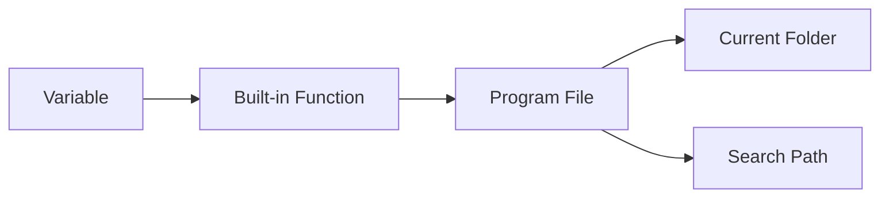
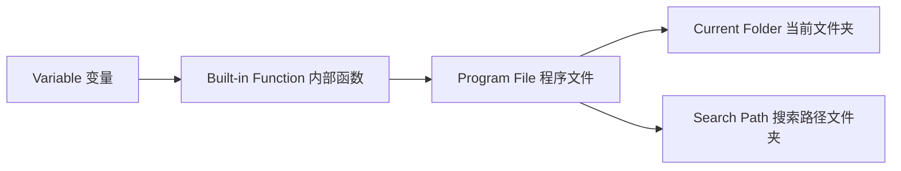

# Chapter 1 MATLAB Basics

## 1.1 MATLAB Environment
### 1.1.1 MATLAB Execution Order / Search Path:
### MATLAB Execution Priority

<details>
<summary>Show Chinese translation</summary>
   

</details>

## 1.2 Numerical Data
### 1.2.1 Classification of numeric data types: Integer, floating-point, complex number
#### Function — to find the signed 8-digit integer format of a given decimal number: 
`int8`, `uint8`

`int16`, `uint16`

`int32`, `uint32`

`int64`, `uint64`

```matlab
x=int8(129) 
x =
127
```
```matlab
x=uint8(129)
x =
129
```
#### Functions to convert other data types to ...⭐matlab default: double
`single`-precision/`double`-precision floating-point data.
>> class(4)
   ans =
   double
>> class(single(4))
   ans =
   single
#### Both the real and imaginary parts of complex data are assumed to be double-precision type.
The imaginary（虚部） unit is represented by i or j.

Function `real`: Calculates the real part of a complex number.

Function `imag`: Calculates the imaginary part of a complex number.

```matlab
6+5i
ans =
6.0000 + 5.0000i
```
```matlab
6+5j
ans =
6.0000 +5.0000i
```
### 1.2.2 Output format of numerical data
format + 格式符format specifier

The `format` command only affects the output format of data; 

it does not affect data calculation or storage.
```matlab
>> format long
>> 50/3
  ans =
  16.666666666666668
```
```matlab
>> format
>> 50/3
  ans =
  16.6667
```
### 1.2.3 Commonly used mathematical functions
#### The function call format is as follows:
Function name (value)

During the operation, the function is applied to each element of the matrix, so the result is still a matrix.
#### Changes in common functions
**1. Trigonometric functions.**

In radians（弧度）: `sin()`

In degrees（角度）: `sind()`
```matlab
>>sin(pi/2)
ans =
     1
```
```matlab
>>sind(90)
ans =
     1
```
**2. The `abs` function can calculate:**

the absolute value of a real number（实数的绝对值）,

the modulus of a complex number（复数的模）, and the

ASCII code value of a string（字符串的ASCII码值）.
```matlab
>>abs(-4)
ans =
     4
```
```matlab
>>abs(3+4i)
ans =
     5
```
```matlab
>>abs('a)
ans =
     97
```
#### Take the integer
Truncate/Floor`floor()`: Remove the decimal part directly.
```matlab
>>floor(3.6)
ans =
     3
```
Rounding`round()`: to the nearest whole number.
```matlab
>>round(4.6)
ans =
     5
```
Ceiling`ceil()`: Carry over if there is a decimal.
```matlab
>>ceil(-3.6)
ans =
     -3
```
`fix`: Regardless of the sign, always take the integer closest to 0.
```matlab
>>fix(-3.6)
ans =
     -3
```
#### Mathematical operations
**1. Find the square root: `sqrt()`**

**2. Natural exponential function：`exp()`**
```matlab
>>x=sqrt(7)-2i;
>>y=exp(pi/2)
>>z=(5+cosd(47))/(1+abs(x-y))


```

## 1.3 Variables and Operations
The data processed by the computer is stored in memory. Each memory location has a unique address. The program accesses the memory unit through the address of this memory unit. In high-level languages, you don't need to specify the address of a memory location; you only need to give each memory location a name, and then you can access the memory location using that name.

<details>
<summary>Chinese explanation</summary>
（计算机处理的数据都是存放于内存单元中的。每个内存单元都有一个唯一的地址。程序就是通过这个内存单元的地址，来访问内存单元。在高级语言中，不需要给出内存单元的地址，只需要给每个内存单元取一个名字，然后就可以通过这个名字访问内存单元了。）
</details>

### 1.3.1 Variables
Variable: An abstraction of a memory unit.

Variable names: must begin with a letter, followed by a sequence of letters/numbers/underscores, with a maximum of 63 characters.

Variable names are case sensitive.

MATLAB's standard function names and command names are generally in lowercase.
               
<details>
<summary>Chinese explanations</summary>
（变量：内存单元的一个抽象）

（变量名：是必须以字母开头，后接字母/数字/下划线的字符序列，最多63个字符，否则报错）

（变量名区分字母大小写）

（Matlab提供的标准函数名及命令名一般用小写字母）
</details>

### 1.3.2 Assignment statements 赋值语句
Two formats

**1. variable=expression**

<details>
<summary>Chinese explanations</summary>
将右边表达式的值赋给左边变量
</details>

**2. expression**

Assigning the value of an expression to a predefined MATLAB variable `ans` will display the result in the command-line window. If a semicolon is added to the assignment statement, MATLAB will only perform the assignment operation and will not display the result.
<details>
<summary>Chinese explanations</summary>
将表达式的值赋给matlab的预定义变量ans，变量结果会在命令行窗口中显示出来。如果在赋值语句中加分号，那么matlab只会进行赋值操作，不会再显示运算后的变量结果。
</details>

---

Example: Title

Expression Evaluation

Compute the following expression and assign the result to variable `z`:

$$
z = \frac{5 + \cos(47^\circ)}{1 + |x - y|}
$$

where:

$$
x = \sqrt{7} - 2i
$$

$$
y = e^{\pi/2}
$$

MATLAB Code

```matlab
x = sqrt(7) - 2i;
y = exp(pi/2);
z = (5 + cosd(47)) / (1 + abs(x - y))
```
Output

```matlab
z =
  1.4395
```
<details> <summary>Chinese Explanation</summary>
这道题的公式英文读作：

Compute z equals five plus cosine of forty-seven degrees,

divided by one plus the absolute value of x minus y,

where x equals the square root of seven minus two i,

and y equals e to the power of pi over two.

这道题在presentation时读作：

We compute z as five plus cosine of forty-seven degrees,

divided by one plus the absolute value of x minus y,

where x is the square root of seven minus two i,

and y is e raised to the power of pi over two.

计算如下表达式，并将结果赋值给变量 z：

z = (5 + cos(47°)) / (1 + |x - y|)

其中：x = √7 - 2i（复数）   y = e^(π/2)

说明：

x调用了求平方根函数`sqrt`；

y调用了自然指数函数`exp`，e^(π/2)不能写成乘方的形式；

z调用了cosd(47) 表示角度制余弦，abs(x - y) 表示复数的模，写代码时分子分母一定要加括号。

命令中的pi和i都是matlab预先定义的变量，分别代表圆周率和虚数单位。
</details> 

---

### 1.3.3 Predefined variables 预定义变量
Predefined variables are variables defined by the system itself.

**1. `ans` Default assignment variable.**

When you enter an expression in the command window, the value of the expression is automatically assigned to `ans`.
<details> <summary>Chinese Explanation</summary>
当在命令窗口输入一个表达式时，表达式的值会自动赋给ans。
</details> 

**2. `i``j`Imaginary unit**

**3. `pi`π**

**4. `NaN` Represents a non-numeric value.**

When drawing a graph, if you want to crop out a portion, simply set the coordinates of the part to be cropped to NaN.
<details> <summary>Chinese Explanation</summary>
在绘图的时候如果想裁掉一部分，那么只要把要裁掉部分的坐标数据设为NaN就可以了。
</details> 

---

Since these predefined variables have specific meanings, we should avoid reassigning them as much as possible. For example, `i` represents the imaginary unit, but it's conventionally used as a loop variable in programs. In this case, `i` is no longer a predefined variable.
<details> <summary>Chinese Explanation</summary>
既然这些预定义变量有特定的含义，在使用时就要尽量避免对它们重新赋值。例如i代表虚数单位，但习惯上在程序中用i作为循环变量。这时i就不再是预定义变量了。
</details> 

---

### 1.3.4 Variable management
**1. Deletion and modification of memory variables**

① In the workspace window, right-click on a variable and select the corresponding modification operation from the shortcut menu.
<details> <summary>Chinese Explanation</summary>
工作区窗口，右击某个变量，在快捷菜单中选择相应的修改操作
</details> 

② `who` Display the name of the resident variable.

`whos` Displays information such as the name, size, number of bytes occupied, and data type of the resident variable.

**2. Memory variable file 内存变量文件**

The file used to store variables in the MATLAB workspace is called a memory variable file, and its extension is .mat, also known as a MAT file.

This is a standard binary format file used by MATLAB to save data.

① `save` Create memory variable file.

② `load` Load memory variable file.

Assuming variables a and x exist in the MATLAB workspace, enter the command
```matlab
>> save mydata a x
```
will save variables a and x in the file mydata.mat.

If we need to use variables a and x after re-entering MATLAB, load the mydata.mat file into the workspace.
```matlab
>>load mydata
```

## 1.4 Matrix Representation
Matrices are the most basic data objects in MATLAB. Most MATLAB operations and commands are performed within the framework of matrix operations. MATLAB offers highly flexible matrix usage; the dimensions and type of the matrix are automatically set based on user input without requiring explicit specification.
### 1.4.1 Enter a matrix
**1. Enter directly**

Square brackets. Comma or spaces separate elements, semicolons separate lines.
```matlab
>> A=[1,2,3;4,5,6;7,8,9]
A =
  1  2  3
  4  5  6
  7  8  9
```

**2. Use the existing matrix to build a larger matrix**
```matlab
>> A=[1,2,3;4,5,6;7,8,9];
>> B=[-1,-2,-3;-4,-5,-6;-7,-8,-9];
>> C=[A,B;B,A]
```
Output
```matlab
C =
   1   2   3  -1  -2  -3
   4   5   6  -4  -5  -6
   7   8   9  -7  -8  -9
  -1  -2  -3   1   2   3
  -4  -5  -6   4   5   6
  -7  -8  -9   7   8   9
```
**3. Complex matrices can be constructed using real and imaginary parts.**
```matlab
>> B=[1,2,3;4,5,6];
>> C=[6,7,8;9,10,11];
>> A=B+i*C
```
Output. Correspondence
```matlab
A =
 1.0000 + 6.0000i   2.0000 + 7.0000i   3.0000 + 8.0000i
 4.0000 + 9.0000i   5.0000 +10.0000i   6.0000 +11.0000i
```
### 1.4.2 Vector generation
**1. Colon expression.**

$$
e1:e2:e3
$$

e1: Initial value

e2: Step size

e3: Terminating value

If step size e2 is omitted, the step size is 1.
```matlab
>> t=0:1:5
t =
   0 1 2 3 4 5
```
```matlab
>> t=0:5
t =
   0 1 2 3 4 5
```
**2. `linspace(a,b,n)`**

`a`: First element

`b`: Last element

`n`: Total number of elements

When `n` is omitted, 100 elements are automatically generated.
```matlab
>> x=(0,pi,6)
x =
   0   0.6283   1.2566   1.8850   2.5133   3.1416
```
### 1.4.3 Structure Matrix and Element Matrix
**1. Structure Matrix**

An entity composed of various types of data items.

A matrix composed of structured data is a structure matrix. Each element in the structure matrix is ​​a structure data type.

**e.g.** A student's data entity includes data items such as student ID, gender, and name. These are interconnected; representing them separately would fail to reflect the integrity of the data.

**Syntax:**

A structure array element is defined as:

$$
Structure matrix element.member name = expression
$$

---

```matlab
>>a(1).x1 = 10;
a(1).x2 = 'liu';
a(1).x3 = [11, 21; 34, 78];

>>a(2).x1 = 12;
a(2).x2 = 'wang';
a(2).x3 = [34, 191; 27, 578];

>>a(3).x1 = 14;
a(3).x2 = 'cai';
a(3).x3 = [13, 890; 67, 231];
```
Entering the above code will create the structure matrix *a*.

* `a` is a structure array（结构体数组）
* `x1`, `x2`, `x3` are fields（字段）
* `a(1)`, `a(2)`, `a(3)` represent different elements in the structure array
* Each field can store different types of data:

  * Numeric values（数值）
  * Strings（字符串）
  * Matrices（矩阵）

---

<details>
<summary>Chinese Explanation</summary>
结构体数组的基本格式为：
   
结构矩阵元素.成员名 = 表达式

说明：
   
* a 是结构体数组
* x1、x2、x3 是字段
* a(1)、a(2)、a(3) 表示不同元素
* 每个字段可以存储不同类型的数据（数值、字符串、矩阵）
</details>


## 1.5 Accessing Matrix Elements

## 1.6 Basic Operations

## 1.7 String Processing
