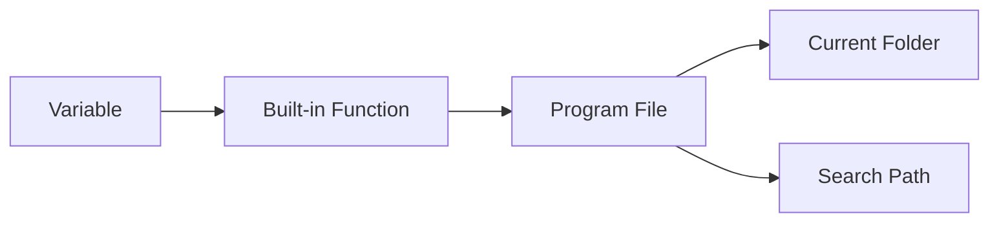
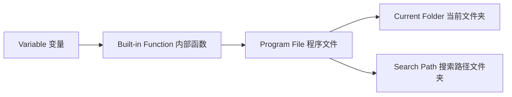

# Chapter 1 MATLAB Basics

## 1.1 MATLAB System Environment
### 1.1.1 MATLAB Execution Order / Search Path:
### MATLAB Execution Priority

<details>
<summary>Show Chinese translation</summary>
   

</details>

## 1.2 MATLAB Numerical Data
### 1.2.1 Classification of numeric data types: Integer, floating-point, complex number
#### Function — to find the signed 8-digit integer format of a given decimal number: 
`int8`, `uint8`

`int16`, `uint16`

`int32`, `uint32`

`int64`, `uint64`

```matlab
x=int8(129) 
x =
127
```
```matlab
x=uint8(129)
x =
129
```
#### Functions to convert other data types to ...⭐matlab default: double
`single`-precision/`double`-precision floating-point data.
>> class(4)
   ans =
   double
>> class(single(4))
   ans =
   single
#### Both the real and imaginary parts of complex data are assumed to be double-precision type.
The imaginary（虚部） unit is represented by i or j.

Function `real`: Calculates the real part of a complex number.

Function `imag`: Calculates the imaginary part of a complex number.

```matlab
6+5i
ans =
6.0000 + 5.0000i
```
```matlab
6+5j
ans =
6.0000 +5.0000i
```
### 1.2.2 Output format of numerical data
format + 格式符format specifier

The `format` command only affects the output format of data; 

it does not affect data calculation or storage.
```matlab
>> format long
>> 50/3
  ans =
  16.666666666666668
```
```matlab
>> format
>> 50/3
  ans =
  16.6667
```
### 1.2.3 Commonly used mathematical functions
#### The function call format is as follows:
Function name (value)

During the operation, the function is applied to each element of the matrix, so the result is still a matrix.
#### Changes in common functions
**1. Trigonometric functions.**

In radians（弧度）: `sin()`

In degrees（角度）: `sind()`
```matlab
>>sin(pi/2)
ans =
     1
```
```matlab
>>sind(90)
ans =
     1
```
**2. The `abs` function can calculate:**

the absolute value of a real number（实数的绝对值）,

the modulus of a complex number（复数的模）, and the

ASCII code value of a string（字符串的ASCII码值）.
```matlab
>>abs(-4)
ans =
     4
```
```matlab
>>abs(3+4i)
ans =
     5
```
```matlab
>>abs('a)
ans =
     97
```
#### Take the integer
Truncate/Floor`floor()`: Remove the decimal part directly.
```matlab
>>floor(3.6)
ans =
     3
```
Rounding`round()`: to the nearest whole number.
```matlab
>>round(4.6)
ans =
     5
```
Ceiling`ceil()`: Carry over if there is a decimal.
```matlab
>>ceil(-3.6)
ans =
     -3
```
`fix`: Regardless of the sign, always take the integer closest to 0.
```matlab
>>fix(-3.6)
ans =
     -3
```
#### Mathematical operations
**1. Find the square root: `sqrt()`**

**2. Natural exponential function：`exp()`**
```matlab
>>x=sqrt(7)-2i;
>>y=exp(pi/2)
>>z=(5+cosd(47))/(1+abs(x-y))


```

## 1.3 Variables
The data processed by the computer is stored in memory. Each memory location has a unique address. The program accesses the memory unit through the address of this memory unit. In high-level languages, you don't need to specify the address of a memory location; you only need to give each memory location a name, and then you can access the memory location using that name.

<details>
<summary>Chinese explanation</summary>
（计算机处理的数据都是存放于内存单元中的。每个内存单元都有一个唯一的地址。程序就是通过这个内存单元的地址，来访问内存单元。在高级语言中，不需要给出内存单元的地址，只需要给每个内存单元取一个名字，然后就可以通过这个名字访问内存单元了。）
</details>

### 1.3.1 Variables
Variable: An abstraction of a memory unit.

Variable names: must begin with a letter, followed by a sequence of letters/numbers/underscores, with a maximum of 63 characters.

Variable names are case sensitive.

MATLAB's standard function names and command names are generally in lowercase.
               
<details>
<summary>Chinese explanations</summary>
（变量：内存单元的一个抽象）

（变量名：是必须以字母开头，后接字母/数字/下划线的字符序列，最多63个字符，否则报错）

（变量名区分字母大小写）

（Matlab提供的标准函数名及命令名一般用小写字母）
</details>

### 1.3.2 Assignment statements 赋值语句
Two formats

**1. variable=expression**

<details>
<summary>Chinese explanations</summary>
将右边表达式的值赋给左边变量
</details>

**2. expression**

Assigning the value of an expression to a predefined MATLAB variable `ans` will display the result in the command-line window. If a semicolon is added to the assignment statement, MATLAB will only perform the assignment operation and will not display the result.
<details>
<summary>Chinese explanations</summary>
将表达式的值赋给matlab的预定义变量ans，变量结果会在命令行窗口中显示出来。如果在赋值语句中加分号，那么matlab只会进行赋值操作，不会再显示运算后的变量结果。
</details>

---

Example: Title

Expression Evaluation

Compute the following expression and assign the result to variable `z`:

$$
z = \frac{5 + \cos(47^\circ)}{1 + |x - y|}
$$

where:

$$
x = \sqrt{7} - 2i
$$

$$
y = e^{\pi/2}
$$

MATLAB Code

```matlab
x = sqrt(7) - 2i;
y = exp(pi/2);
z = (5 + cosd(47)) / (1 + abs(x - y))
```
Output

```matlab
z =
  1.4395
```
<details> <summary>Chinese Explanation</summary>
这道题的公式英文读作：

Compute z equals five plus cosine of forty-seven degrees,

divided by one plus the absolute value of x minus y,

where x equals the square root of seven minus two i,

and y equals e to the power of pi over two.

这道题在presentation时读作：

We compute z as five plus cosine of forty-seven degrees,

divided by one plus the absolute value of x minus y,

where x is the square root of seven minus two i,

and y is e raised to the power of pi over two.

计算如下表达式，并将结果赋值给变量 z：

z = (5 + cos(47°)) / (1 + |x - y|)

其中：x = √7 - 2i（复数）   y = e^(π/2)

说明：

x调用了求平方根函数`sqrt`；

y调用了自然指数函数`exp`，e^(π/2)不能写成乘方的形式；

z调用了cosd(47) 表示角度制余弦，abs(x - y) 表示复数的模，写代码时分子分母一定要加括号。

命令中的pi和i都是matlab预先定义的变量，分别代表圆周率和虚数单位。
</details> 

---

### 1.3.3 Predefined variables 预定义变量
Predefined variables are variables defined by the system itself.

**1. `ans` Default assignment variable.**

When you enter an expression in the command window, the value of the expression is automatically assigned to `ans`.
<details> <summary>Chinese Explanation</summary>
当在命令窗口输入一个表达式时，表达式的值会自动赋给ans。
</details> 

**2. `i``j`Imaginary unit**

**3. `pi`π**

**4. `NaN` Represents a non-numeric value.**

When drawing a graph, if you want to crop out a portion, simply set the coordinates of the part to be cropped to NaN.
<details> <summary>Chinese Explanation</summary>
在绘图的时候如果想裁掉一部分，那么只要把要裁掉部分的坐标数据设为NaN就可以了。
</details> 

---

Since these predefined variables have specific meanings, we should avoid reassigning them as much as possible. For example, `i` represents the imaginary unit, but it's conventionally used as a loop variable in programs. In this case, `i` is no longer a predefined variable.
<details> <summary>Chinese Explanation</summary>
既然这些预定义变量有特定的含义，在使用时就要尽量避免对它们重新赋值。例如i代表虚数单位，但习惯上在程序中用i作为循环变量。这时i就不再是预定义变量了。
</details> 

---

### 1.3.4 Variable management
**1. Deletion and modification of memory variables**

① In the workspace window, right-click on a variable and select the corresponding modification operation from the shortcut menu.
<details> <summary>Chinese Explanation</summary>
工作区窗口，右击某个变量，在快捷菜单中选择相应的修改操作
</details> 

② `who` Display the name of the resident variable.

`whos` Displays information such as the name, size, number of bytes occupied, and data type of the resident variable.

**2. Memory variable file 内存变量文件**

The file used to store variables in the MATLAB workspace is called a memory variable file, and its extension is .mat, also known as a MAT file.

This is a standard binary format file used by MATLAB to save data.

① `save` Create memory variable file.

② `load` Load memory variable file.

Assuming variables a and x exist in the MATLAB workspace, enter the command
```matlab
>> save mydata a x
```
will save variables a and x in the file mydata.mat.

If we need to use variables a and x after re-entering MATLAB, load the mydata.mat file into the workspace.
```matlab
>>load mydata
```

## 1.4 MATLAB Matrix Representation
Matrices are the most basic data objects in MATLAB. Most MATLAB operations and commands are performed within the framework of matrix operations. MATLAB offers highly flexible matrix usage; the dimensions and type of the matrix are automatically set based on user input without requiring explicit specification.
### 1.4.1 Enter a matrix
**1. Enter directly**

Square brackets. Comma or spaces separate elements, semicolons separate lines.
```matlab
>> A=[1,2,3;4,5,6;7,8,9]
A =
  1  2  3
  4  5  6
  7  8  9
```

**2. Use the existing matrix to build a larger matrix**
```matlab
>> A=[1,2,3;4,5,6;7,8,9];
>> B=[-1,-2,-3;-4,-5,-6;-7,-8,-9];
>> C=[A,B;B,A]
```
Output
```matlab
C =
   1   2   3  -1  -2  -3
   4   5   6  -4  -5  -6
   7   8   9  -7  -8  -9
  -1  -2  -3   1   2   3
  -4  -5  -6   4   5   6
  -7  -8  -9   7   8   9
```
**3. Complex matrices can be constructed using real and imaginary parts.**
```matlab
>> B=[1,2,3;4,5,6];
>> C=[6,7,8;9,10,11];
>> A=B+i*C
```
Output. Correspondence
```matlab
A =
 1.0000 + 6.0000i   2.0000 + 7.0000i   3.0000 + 8.0000i
 4.0000 + 9.0000i   5.0000 +10.0000i   6.0000 +11.0000i
```
### 1.4.2 Vector generation
**1. Colon expression.**

$$
e1:e2:e3
$$

e1: Initial value

e2: Step size

e3: Terminating value

If step size e2 is omitted, the step size is 1.
```matlab
>> t=0:1:5
t =
   0 1 2 3 4 5
```
```matlab
>> t=0:5
t =
   0 1 2 3 4 5
```
**2. `linspace(a,b,n)`**

`a`: First element

`b`: Last element

`n`: Total number of elements

When `n` is omitted, 100 elements are automatically generated.
```matlab
>> x=(0,pi,6)
x =
   0   0.6283   1.2566   1.8850   2.5133   3.1416
```
### 1.4.3 Structure matrix and element matrix
**Each element** of the structure matrix has members, and each member has its own name. While **each element** of the unit matrix represents different types of data.

**1. Structure Matrix**

An entity composed of various types of data items.

A matrix composed of structured data is a structure matrix. Each element in the structure matrix is ​​a structure data type.

**e.g.** A student's data entity includes data items such as student ID, gender, and name. These are interconnected; representing them separately would fail to reflect the integrity of the data.

**Syntax:**

A structure array element is defined as:

$$
Structure matrix element.member name = expression
$$

---

```matlab
>>a(1).x1 = 10;
a(1).x2 = 'liu';
a(1).x3 = [11, 21; 34, 78];

>>a(2).x1 = 12;
a(2).x2 = 'wang';
a(2).x3 = [34, 191; 27, 578];

>>a(3).x1 = 14;
a(3).x2 = 'cai';
a(3).x3 = [13, 890; 67, 231];
```
Entering the above code will create the structure matrix *a*. 

* `a` is a structure array（结构体数组）
* `x1`, `x2`, `x3` are fields（字段）
* `a(1)`, `a(2)`, `a(3)` represent different elements in the structure array
* Each field can store different types of data:

  * Numeric values（数值）
  * Strings（字符串）
  * Matrices（矩阵）

---

<details>
<summary>Chinese Explanation</summary>
结构体数组的基本格式为：
   
结构矩阵元素.成员名 = 表达式

说明：
   
* a 是结构体数组
* x1、x2、x3 是字段
* a(1)、a(2)、a(3) 表示不同元素
* 每个字段可以存储不同类型的数据（数值、字符串、矩阵）
</details>

**2. Element Matrix**
Input directly, similar to a regular matrix, but using curly braces instead of square brackets.

```matlab
>> b = {10,'liu',[11,21;34,78];12,'wang',[34,191;27,578];...
14, 'cai', [13, 890; 67, 231]
b = {
    10, 'liu',  [11, 21; 34, 78];
    12, 'wang', [34, 191; 27, 578];
    14, 'cai',  [13, 890; 67, 231]
};
```

## 1.5 Matrix Elements Reference

### 1.5.1 Referencing matrix elements by index
```matlab
>> A=[1,2,3;4,5,6]
>> A(4,5)=10
A =
   1  2  3  0  0
   4  5  6  0  0
   0  0  0  0  0
   0  0  0  0 10
```

### 1.5.2 Use the index of the matrix element to reference the matrix element.

In MATLAB, matrix elements are stored column-wise. The index of a matrix element determines its order in memory.

```matlab
>> A=[1,2,3;4,5,6]
>> A(3)
ans= 
     2
```

The index and subscript are in one-to-one correspondence. Taking an m*n matrix A as an example, the index of matrix element A(i,j) is (j-1)*m+1.

The index and subscript of matrix elements can be converted to each other using `sub2ind` and `ind2sub`.

①`sub2ind`: Convert the row and column indices of specified elements into their stored serial numbers.

<details>
<summary>Chinese Explanation</summary>
Matlab中矩阵元素按列存储。矩阵元素的序号就是其在内存中的排列顺序。
序号与下标是一一对应的，以m×n矩阵A为例，矩阵元素A(i,j)的序号为(j-1)*m+i
矩阵元素的序号与下标用sub2ind和ind2sub相互转换
将矩阵中指定元素的行、列下标转换成存储的序号
</details>

The calling format is:

$$
D = sub2ind(S,I,J)
$$

Where **S** is the matrix. The number of rows and columns of the matrix to be transformed, and is a vector consisting of the number of rows and columns, which we usually obtain using the size function.

**I** is the row subscripts of the matrix element to be transformed.

**J** is the column subscript of the matrix element to be transformed.

If **I** and **J** are matrices, this means converting the row and column indices of multiple elements in the matrix into storage indices. Therefore, I and J must have the same number of rows and columns. 

**D** is the index of the corresponding element, and its number of rows and columns is the same as **I** and **J**.

<details>
<summary>Chinese Explanation</summary>
   
“其中S是要转换的矩阵的行数和列数，是由行数和列数组成的向量，通常我们用size函数来获取。”S就是矩阵的大小，比如本例中size(A) = [2,3]是在说A是个两行三列的矩阵。
   
“I是要转换矩阵元素的行下标，J是要转换矩阵元素的列下标。”I = 第几行，J = 第几列。

“如果I和J是矩阵的话，表示要将矩阵中的多个元素的行列下标转换成存储的序号，那么IJ的行列数必须相同。”你一次想查多个位置 → 就必须一一配对。比如查一个点时sub2ind([2,3], 1, 2)就是在查点查 (1,2)；查多个点时I = [1 2]，J = [2 3]，sub2ind([2,3], I, J)查的是点(1,2)和(2,3)，为什么格外强调这个是因为IJ是分开写的。如果你写I = [1 2]，J = [2 3 1]，多出来的“1”matlab无法对应，就会报错。

“D为对应下标元素的序号，它的行列数与I、J相同。”D 的形状（大小）和 I、J 一样。输入I = [1 2 1]，J = [2 3 1]，D = sub2ind([2,3], I, J)，结果D = [3 6 1]
</details>

---
```matlab
>>A = [1:3; 4:6]

A =
     1     2     3
     4     5     6

>>D = sub2ind(size(A), [1 2; 2 2], [1 1; 3 2])

D =
     1     2
     6     4
``` 
---


②`ind2sub`: Convert the serial number to the corresponding subscript

The calling format is:

$$
[I,J] = ind2sub(S,D)
$$

Where **S** is the matrix.

**D** is the index.

**I** is the row subscripts. 

**J** is the column subcsripts.

---
```matlab
>>[I,J]=ind2sub[3,3][1,3,5]
I =
  1  3  2
J =
  1  1  2
```

### 1.5.3 Colon expression to reference

Obtain a submatrix (A matrix consisting of a subset of the elements of a matrix).

A single colon can also be used as a row/column index to indicate all rows/columns.

```text
A(i,:)            All elements in the i-th row
A(:,j)            All elements in the j-th column
A(i:i+m,j:j+m)    ...
A(i:i+m,:)        ...
```

### 1.5.4 Use general vectors and the `end` operator
to represent matrix indices to obtain submatrices.

`end`: Indicates the index of the last row/column.

### 1.5.5 Delete elements using an empty matrix.

An empty matrix contains no elements.

```matlab
>>x=[]
x =
   []
```

---
```matlab
>>A=[1,2,3,0,0;7,0,9,2,6;1,4,-1,1,8]
A =
   1  2  3  0  0
   7  0  9  2  6
   1  4 -1  1  8
>>A(:,[2,4])=[]
A =
   1  3  0
   7  9  6
   1 -1  8
```
---
### 1.5.6 Changing the shape of a matrix using an empty matrix
`reshape(A,m,n)`: Rearrange matrix A into an m×n two-dimensional matrix, while keeping the total number of elements of the matrix unchanged, without changing the number of elements and storage order of the original matrix.

```matlab
>>x=[23,45,65,34,65,34,98,45,78,65,43,76]
>>y=reshape(x,3,4)
y =
   23  34  98  65
   45  65  45  43
   65  34  78  76
```
`A(:)`: Stack the elements of each column of matrix A to form a column vector.

```matlab
>>A=[-45,65,71;27,35,91]
A =
   -45   65   71
    27   35   91
>>B=A(:)
B =
-45
 27
 65
 35
 71
 91
```
At this point, A() is equivalent to reshape(A, 6, 1).

## 1.6 Basic Operations of MATLAB

### 1.6.1 Arithmetic operations

#### Basic arithmetic operations
Addition +, subtraction -, multiplication *, division (left division \ and right division /), exponentiation ^.

* MATLAB arithmetic operations are performed in the matrix sense; arithmetic operations on individual data are just a special case of matrix operations.

① `+`, `-`: The matrices must be of the same type; otherwise, an error will occur. Or perform operations on a scalar and a matrix---When adding or subtracting a scalar and a matrix, perform the addition or subtraction operation on each element of the scalar and the matrix.

② `*`: The number of columns in matrix A = the number of rows in matrix B. Then matrices A and B are said to be multiplicative, or said that the dimensions and sizes of matrices A and B are compatible. Else, error.

③ Right division `/` and left division`\`: If matrix A is a non-singular square matrix, then `B/A` is equivalent to `B*inv(A)`, and `A\B` is equivalent to `inv(A)*B`.

④ Exponentiation: A^X, where A is a square matrix and X is a scalar.

* Matrix multiplication is not commutative. Matrix multiplication = row × column, inner sizes must match. Element-wise multiplication (Hadamard product), same size (same shape).

#### Element-wise operation
Operators: `.*`, `./`, `.\`, `.^`

The two matrices must be of the same type.

Element-wise operations are unique and practical operators in MATLAB.

---
Find the values ​​of y = sin x cos x for x = 0.1, 0.4, 0.7, and 1 respectively.
```matlab
>>x=0.1:0.3:1;
>>y=sin(x).*cos(x)
```
* Ought to be element-wise operation. Since `x` is a vector, `sin x` and `cos x` are vectors of the same length as `x`. Using multiplication would result in an error because multiplying two vectors is incompatible.
---

### 1.6.2 Relational operations
Less than `<,` less than or equal to `<=`, greater than `>`, greater than or equal to `>=`, equal to `==`, not equal to `~=`.

* If the two variables being compared are scalars, directly compare the size of the two numbers. If the relation holds, the result of the relational expression is 1; otherwise, it is 0.

* When the quantities being compared are two matrices of the same type, the comparison is performed element-wise according to scalar relation rules at the same positions of the two matrices. The result is also a row-column matrix composed of 0s and 1s.

* Comparing a scalar and a matrix involves comparing each element of the scalar and the matrix one by one according to the rules of scalar operations. The result is a matrix of the same type, consisting of 0s and 1s.

---
Construct a 3x3 square matrix A and determine whether the elements of A are even.
```matlab
>>A=[24,35,13;22,63,23;39,47,80]
A =
    24  35  13
    22  63  23
    39  47  80
>>P=rem(A,2)==0
P =
   1  0  0
   1  0  0
   0  0  1
  
```
---

### 1.6.3 Logical operations
And `&`, Or `|`, Not `~`.

#### Scalars
For scalars `a` and `b`:

① `a&b`: The result is 1 if both `a` and `b` are non-zero; otherwise, it is 0.

② `a|b`: The result is 1 if either `a` or `b` is non-zero.

③ `~a`: When `a` is 0, the result is 1; when `a` is non-zero, the result is 0.

```matlab
>> 3<4 & 6>5
ans =
   1
```
```matalb
>>~(9==1)
ans =
   1
```
```matlab
>>~9==1
ans =
   0
```

* Operator precedence: Among arithmetic, relational, and logical operations, arithmetic operations have the highest precedence, and logical operations have the lowest precedence. However, logical operations are unary operations, so their precedence is higher than that of binary operations.

#### Same type matrix
Elements at the same position in a matrix are operated on one by one according to scalar rules. The result is a matrix of the same type, consisting of 0s and 1s.


## 1.7 String Processing


