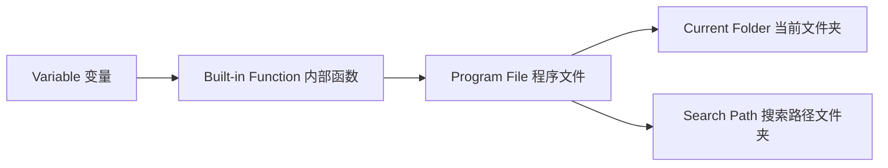

# Chapter 1 MATLAB Basics

## 1.1 MATLAB Environment
### MATLAB Execution Order / Search Path:

### Classification of numeric data types: Integer, floating-point, complex number
#### Function — to find the signed 8-digit integer format of a given decimal number: 
`int8`, `uint8`

`int16`, `uint16`

`int32`, `uint32`

`int64`, `uint64`

```matlab
x=int8(129) 
x =
127
```
```matlab
x=uint8(129)
x =
129
```
#### Functions to convert other data types to ...⭐matlab default: double
`single`-precision/`double`-precision floating-point data.
>> class(4)
   ans =
   double
>> class(single(4))
   ans =
   single
#### Both the real and imaginary parts of complex data are assumed to be double-precision type.
The imaginary（虚部） unit is represented by i or j.

Function `real` - calculates the real part of a complex number.

Function `imag` - calculates the imaginary part of a complex number.

```matlab
6+5i
ans =
6.0000 + 5.0000i
```
```matlab
6+5j
ans =
6.0000 +5.0000i
```
### Output format of numerical data
format + 格式符format specifier

The `format` command only affects the output format of data; it does not affect data calculation or storage.
```matlab
>> format long
>> 50/3
  ans =
  16.666666666666668
```
```matlab
>> format
>> 50/3
  ans =
  16.6667
```
### Commonly used mathematical functions
#### The function call format is as follows:
Function name (value)


## 1.2 Numerical Data

## 1.3 Variables and Operations

## 1.4 Matrix Representation

## 1.5 Accessing Matrix Elements

## 1.6 Basic Operations

## 1.7 String Processing
