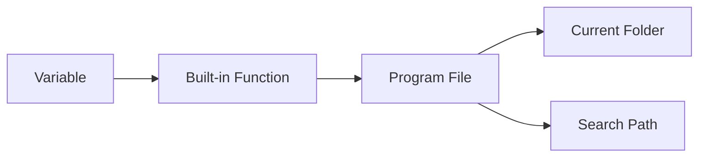
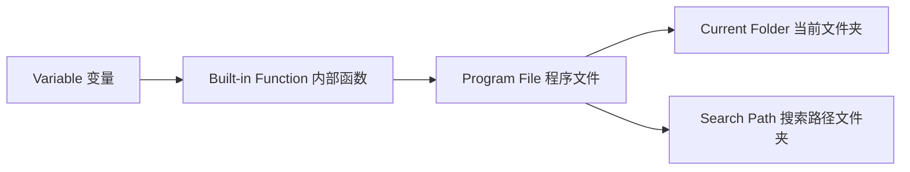

# Chapter 1 MATLAB Basics

## 1.1 MATLAB Environment
### 1.1.1 MATLAB Execution Order / Search Path:
### MATLAB Execution Priority

<details>
<summary>Show Chinese translation</summary>
   

</details>

## 1.2 Numerical Data
### 1.2.1 Classification of numeric data types: Integer, floating-point, complex number
#### Function — to find the signed 8-digit integer format of a given decimal number: 
`int8`, `uint8`

`int16`, `uint16`

`int32`, `uint32`

`int64`, `uint64`

```matlab
x=int8(129) 
x =
127
```
```matlab
x=uint8(129)
x =
129
```
#### Functions to convert other data types to ...⭐matlab default: double
`single`-precision/`double`-precision floating-point data.
>> class(4)
   ans =
   double
>> class(single(4))
   ans =
   single
#### Both the real and imaginary parts of complex data are assumed to be double-precision type.
The imaginary（虚部） unit is represented by i or j.

Function `real`: Calculates the real part of a complex number.

Function `imag`: Calculates the imaginary part of a complex number.

```matlab
6+5i
ans =
6.0000 + 5.0000i
```
```matlab
6+5j
ans =
6.0000 +5.0000i
```
### 1.2.2 Output format of numerical data
format + 格式符format specifier

The `format` command only affects the output format of data; 

it does not affect data calculation or storage.
```matlab
>> format long
>> 50/3
  ans =
  16.666666666666668
```
```matlab
>> format
>> 50/3
  ans =
  16.6667
```
### 1.2.3 Commonly used mathematical functions
#### The function call format is as follows:
Function name (value)

During the operation, the function is applied to each element of the matrix, so the result is still a matrix.
#### Changes in common functions
1. Trigonometric functions.

In radians（弧度）: `sin()`

In degrees（角度）: `sind()`
```matlab
>>sin(pi/2)
ans =
     1
```
```matlab
>>sind(90)
ans =
     1
```
2. The `abs` function can calculate:

the absolute value of a real number（实数的绝对值）,

the modulus of a complex number（复数的模）, and the

ASCII code value of a string（字符串的ASCII码值）.
```matlab
>>abs(-4)
ans =
     4
```
```matlab
>>abs(3+4i)
ans =
     5
```
```matlab
>>abs('a)
ans =
     97
```
#### Take the integer
Truncate/Floor`floor()`: Remove the decimal part directly.
```matlab
>>floor(3.6)
ans =
     3
```
Rounding`round()`: to the nearest whole number.
```matlab
>>round(4.6)
ans =
     5
```
Ceiling`ceil()`: Carry over if there is a decimal.
```matlab
>>ceil(-3.6)
ans =
     -3
```
`fix`: Regardless of the sign, always take the integer closest to 0.
```matlab
>>fix(-3.6)
ans =
     -3
```
#### Mathematical operations
1. Find the square root: `sqrt()`

2. Natural exponential function：`exp()`
```matlab
>>x=sqrt(7)-2i;
>>y=exp(pi/2)
>>z=(5+cosd(47))/(1+abs(x-y))


```


## 1.3 Variables and Operations
The data processed by the computer is stored in memory. Each memory location has a unique address. The program accesses the memory unit through the address of this memory unit. In high-level languages, you don't need to specify the address of a memory location; you only need to give each memory location a name, and then you can access the memory location using that name.

<details>
<summary>Chinese explanation</summary>
（计算机处理的数据都是存放于内存单元中的。每个内存单元都有一个唯一的地址。程序就是通过这个内存单元的地址，来访问内存单元。在高级语言中，不需要给出内存单元的地址，只需要给每个内存单元取一个名字，然后就可以通过这个名字访问内存单元了。）
</details>

### Variables
Variable: An abstraction of a memory unit.

Variable names: must begin with a letter, followed by a sequence of letters/numbers/underscores, with a maximum of 63 characters.

Variable names are case sensitive.

MATLAB's standard function names and command names are generally in lowercase.
               
<details>
<summary>Chinese explanations</summary>
（变量：内存单元的一个抽象）

（变量名：是必须以字母开头，后接字母/数字/下划线的字符序列，最多63个字符，否则报错）

（变量名区分字母大小写）

（Matlab提供的标准函数名及命令名一般用小写字母）
</details>

### Assignment statements 赋值语句
Two formats

1. variable=expression
<details>
<summary>Chinese explanations</summary>
将右边表达式的值赋给左边变量
</details>

2.expression

Assigning the value of an expression to a predefined MATLAB variable `ans` will display the result in the command-line window. If a semicolon is added to the assignment statement, MATLAB will only perform the assignment operation and will not display the result.
<details>
<summary>Chinese explanations</summary>
将表达式的值赋给matlab的预定义变量ans，变量结果会在命令行窗口中显示出来。如果在赋值语句中加分号，那么matlab只会进行赋值操作，不会再显示运算后的变量结果。
</details>

---

Example: Title

Expression Evaluation

Compute the following expression and assign the result to variable `z`:

\[
z = \frac{5 + \cos(47^\circ)}{1 + |x - y|}
\]

where:

- \( x = \sqrt{7} - 2i \)
- \( y = e^{\pi/2} \)

MATLAB Code

```matlab
x = sqrt(7) - 2i;
y = exp(pi/2);
z = (5 + cosd(47)) / (1 + abs(x - y))
```
<details> <summary>Chinese Explanation</summary>

计算如下表达式，并将结果赋值给变量 z：

z = (5 + cos(47°)) / (1 + |x - y|)

其中：

x = √7 - 2i（复数）
y = e^(π/2)

说明：

cosd(47) 表示角度制余弦
abs(x - y) 表示复数的模
</details> 


## 1.4 Matrix Representation

## 1.5 Accessing Matrix Elements

## 1.6 Basic Operations

## 1.7 String Processing
