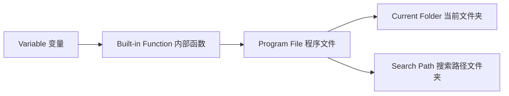

# Chapter 1 MATLAB Basics

## 1.1 MATLAB Environment
MATLAB Execution Order / Search Path:

Classification of numeric data types: Integer, floating-point, complex number

## 1.2 Numerical Data

## 1.3 Variables and Operations

## 1.4 Matrix Representation

## 1.5 Accessing Matrix Elements

## 1.6 Basic Operations

## 1.7 String Processing
